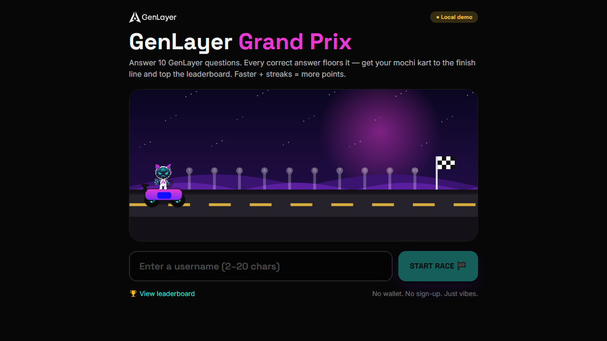

# 🏁 GenLayer Grand Prix

A GenLayer-branded **typing race** on trivia, in the spirit of
[TypeRacer](https://play.typeracer.com/). Pick any of 10 GenLayer questions, in any order,
then play it in two typed stages: **retype the question verbatim** — your mochi kart moves
with every correct character — and then **type the answer** to bank the checkpoint. You get
**10 minutes** for the whole quiz; speed, accuracy and correct answers all feed your score.
Built for the GenLayer community.



## Features

- **TypeRacer-style question stage** — the question is a passage you retype character by
  character. Correct characters go green, a wrong one goes red and **freezes the kart until
  you backspace it**, and live WPM + accuracy tick as you type. Pasting is rejected outright:
  anything that jumps more than one character at a time is not typing.
- **Two typed stages per question** — retype the question (worth 70% of that question's
  kart distance), which unlocks the answer field; type the answer to bank the checkpoint.
  Half-typed questions keep their progress if you jump back to the board.
- **Pick-your-own-order question board** — all 10 questions are shown up front; play them
  in whatever order you like, and retry an answer as many times as you want.
- **Smart answer matching** — 10 fact-checked GenLayer questions, case/punctuation-
  insensitive, accepts synonyms, tolerates a 1-char typo.
- **Smash-Karts-style race** — Canvas side-scroller with the mochi kart, parallax
  GenLayer scenery, boost on correct, skid on wrong, checkpoints + finish flag.
- **Mochi reacts** — the mascot's face turns **happy** 😄 on a correct answer and
  **angry** 😡 on a wrong one (aura, hop, and expression drawn on the canvas).
- **10-minute session timer** for the whole quiz · score = **1,000 per correct answer**
  + up to 500 for the time still on the clock + up to 300 for typing accuracy + up to 100
  for raw speed. The bonuses total 900, less than a single answer, so a fast partial run
  can never out-rank a complete one.
- **2 hints per session** — a hint reveals only the **first and last letter** of the
  answer (`o _ _ _ _ _ _ _ _ _   _ _ _ _ _ _ _ _ y`).
- **Join from the home page with a username and a code** — the code *is* the room. With
  the built-in questions it is ten characters (`0ANAN427H3`), and it carries the quiz and
  its own creation time, so it works on any device with no server and no sign-up. There is
  also an invite link (`genprix.vercel.app/r/0ANAN427H3`) that skips straight to the
  username box.
- **Codes expire after 15 minutes** — the creation minute is baked into the code itself,
  so every device agrees on the deadline; a guest cannot refresh their way into more time.
  Past that, the code is refused with an explanation.
- **One code, one game** — a room is **single use**. It is burned the moment a run ends,
  and a name that already raced in it cannot rejoin, so the same room can never host a
  second round on that device. Hosts create a fresh room per round.
- **Username only** — no wallet, no sign-up. Just a name (auto mochi avatar).
- **Speed leaderboard** — first place goes to whoever completes the game fastest with
  the most exact typing, and the board reads down from there until the clock runs out.
  Questions solved is the first key (a correct answer outweighs every bonus combined),
  then the time left, then typing accuracy — all folded into the score, with time as the
  tiebreak. **Auto-resets every clock hour** with a live "resets in mm:ss" countdown.
- **Admin panel** — a discreet 🔒 button in the bottom-right corner opens the passcode-gated
  admin, where you input the questions/answers and create the room.
- **Capture guard during a live round** — question text can't be selected, copied,
  right-clicked or dragged, the copy/save/print shortcuts are swallowed, and the board
  blurs the moment the page loses focus. The answer field stays fully editable. See the
  honest limits in Security below.
- **Cheat-resistant** — in secure mode, answers never reach the browser and scores are
  computed and written server-side (see Security below).
- **Share card** — export a 1600×900 PNG of your result for X.

## Run it

```bash
npm install
npm run dev      # http://localhost:5200
npm test         # vitest unit tests
npm run build    # typecheck + production build
```

Out of the box it runs in **local/demo mode** (per-device, single machine). Because a game
needs an active room, do this once to play locally:

1. Copy `.env.example` to `.env.local` and set `VITE_ADMIN_PASSCODE` to your own code
   (it defaults to `000000` so a fresh clone runs, and `.env.local` is gitignored — the
   real passcode is never committed).
2. Click the **🔒** button (bottom-right) → enter that passcode.
3. Edit the 10 questions if you want, then **Create room & get code**.
4. Go back, enter a username + the code, and race. The code is good for 15 minutes.

(In local/demo mode the room + scores live in this browser only. Cross-device rooms and the
global board need Supabase — see below.)

## Go live (global board + admin + anti-cheat)

Connect a free Supabase project (~5 min) — see **[SETUP.md](./SETUP.md)**. In short:

1. Create a Supabase project, run [`supabase.sql`](./supabase.sql) in the SQL editor.
2. `select set_admin_passcode(null, '<ADMIN_PASSCODE>');`
3. Put the project URL + anon key in `.env.local` (`VITE_SUPABASE_URL`, `VITE_SUPABASE_ANON_KEY`).
4. Open `/admin`, enter the passcode, publish the first week's questions.

A **"Global board"** badge on the start screen confirms secure mode is on.

### Hosting a game
🔒 (bottom-right) → passcode → edit the 10 questions → **Create room & get code** → **Copy
invite link**. Share that link. Players open it, type a username, and race those questions.
The room covers one game only and the code dies 15 minutes after you create it, so make it
when your players are ready, not before. The panel counts the time down for you. The
leaderboard resets at the top of every hour.

**The code carries the room.** In local/demo mode there is no server to look a room up in,
so a plain label would mean nothing on a phone that has never seen it. The code itself is
the room: `0` + five characters of creation minute + two random + two check characters.
Players type it on the home page next to their username and race — any device, no link
needed. (The code box also takes a pasted invite link or room key.)

**Why the check characters.** Without them every string starting with `0` would open a game
the host never ran. They also catch a mistyped character. It is obscurity, not security —
the rule is in the bundle, like everything else in demo mode.

**Editing the questions makes the code long.** An unedited quiz needs no payload at all,
because every device already ships those ten questions. Edit one and only that one travels,
indexed against the built-in set, so two edits cost two questions rather than ten; the admin
panel tells you how many differ and offers one click back to the built-in set. Rewrite all
ten and the code is too long to type — share the link instead. There is nowhere else to put
them without a backend. Records use ASCII separators instead of JSON, and a four-character
checksum makes a link a chat client clipped fail loudly rather than decode into a quiz with
truncated answers.

**What local/demo mode still cannot do:** scores stay on the device that made them, so
players will not see each other on the leaderboard, and "one code, one game" is enforced per
device rather than globally. Both need a shared backend: connect Supabase (above) and the
room code works on its own, the board goes global, and the single-use rule is enforced in
Postgres.

## Security

Local/demo mode is not secured (there's no shared board to cheat). **Secure mode**
(Supabase configured) is hardened:

- **Answers are hidden** — the `questions` table has no anonymous read access; the browser
  only ever receives prompts + hints via a column-filtered view. Answer checking happens
  inside a Postgres function.
- **Server-authoritative scoring** — there is no client "submit score" path. A run is a
  server-side session (`start_run` → `answer_question` × N → `finish_run`); the DB checks
  each answer, measures timing on its own clock (so speed can't be faked), computes the
  score, clamps it to the maximum possible (10900), and writes the only leaderboard row.
- **Single-use room codes are enforced in Postgres too** — `finish_run` flips the room to
  `done`, and `join_room` refuses both a closed code and a name that already has a run in
  that room.
- **Admin passcode** — stored as a **bcrypt hash** (never shipped to the client),
  validated only inside a `SECURITY DEFINER` RPC, with **rate-limit lockout** (5 failed
  attempts / 15 min) so a 6-digit code can't be brute-forced through the API.

**Capture guard** (`src/game/useCaptureGuard.ts`), active only while a round is live:
selection, copy/cut, context menu and drag are refused on question text; `Ctrl/Cmd`
+ `C/X/A/S/P/U` and the Firefox screenshot shortcut are swallowed; the questions blur on
`blur`/`visibilitychange`; PrintScreen blurs and overwrites the clipboard. The answer
field is exempt throughout, so players can still type, select and copy their own answer.

> **A web page cannot block a screenshot.** The screen belongs to the OS — PrintScreen,
> the Snipping Tool, `Cmd+Shift+4`, a phone's screenshot combo, or a second phone pointed
> at the monitor all happen outside the browser's reach, and no web API can veto them.
> The guard raises the effort; it does not make leaking impossible. Anything that must
> actually be enforced has to be enforced server-side.

> **The passcode is not a secret in local/demo mode.** Vite inlines every `VITE_*` var
> into the client bundle, so `VITE_ADMIN_PASSCODE` is readable by anyone who opens
> devtools on the deployed site. Keeping it in `.env.local` + the host's env store keeps
> it out of the public repo and git history, which is worth doing, but it is not
> protection. If the admin panel genuinely needs to be locked down, enable secure mode —
> there the passcode never leaves Postgres.

See **[SECURITY-AUDIT.md](./SECURITY-AUDIT.md)** for the verification checklist.

## Performance

Sized for a community drop where a few hundred to a thousand people open the link at once.

**Per visitor: 241 KB** (was 1.32 MB). Measured with `tools/bench-load.mjs`, which fetches
the exact asset set a cold first load pulls:

| 200 concurrent visitors | before | after |
| --- | --- | --- |
| bytes per visitor | 1.32 MB | 0.24 MB |
| total transferred | 264 MB | 48 MB |
| wall clock | 18.2 s | 2.4 s |
| p95 latency | 17.4 s | 2.3 s |

At 1000 concurrent visitors the optimized build moves 241 MB in 7.3 s (137 visitors/s).

Those absolute times come from a single-threaded Node server on loopback
(`tools/bench-server.mjs`), so treat them as a **relative** before/after — a real static
host serves this from a CDN edge and 1000 concurrent visitors is not a load event. The
number that carries over to production is bytes per visitor.

What made the difference:

- **The kart mascot is pre-baked** (`tools/bake-mascot.md`). It used to download the
  1.1 MB brand sheet, crop it, and run an edge flood-fill on 2.1 M pixels in the browser —
  **1.13 MB + ~176 ms of blocked main thread per visitor**, and the flood fill removed
  nothing at all, because the sheet already ships an alpha channel. It is now a 22 KB
  WebP (69 KB PNG fallback) that the browser decodes off-thread.
- **Ranking no longer downloads the leaderboard.** Finishing a run used to pull up to
  9999 rows to work out your placement — with a whole community finishing inside one
  hour bucket that is one full-board download *per finisher*. `rankFor()` now asks
  Postgres for a `head`+`count` (an index-only count on `scores_hour_rank`), or counts
  locally in demo mode.
- **The session clock only re-renders on a second boundary.** It polls 4x a second so the
  run still ends promptly, but the HUD reads `mm:ss`, so three of every four ticks used
  to re-render the whole tree — canvas, HUD, and all ten question cards — to paint
  identical pixels. `QuestionBoard`, `QuestionPanel`, and `RaceCanvas` are memoised too.
- **Dead weight removed from `public/`:** the brand sheet and two unused mark PNGs moved
  to `tools/`, and the favicon `<link>` pointed at `/brand/favicon.svg` when the file is
  at `/favicon.svg` — a 404 on every single page load.

The canvas render itself was never the problem: measured 60 fps, median frame 16.7 ms,
p95 16.7 ms, zero frames over 20 ms.

Still on the table: `wordmark-white.png` is 34 KB for a logo drawn 24 px tall (~29 KB to
be had), and the Google Fonts stylesheet plus two woff2 files (~80 KB) are third-party
requests that could be self-hosted.

Re-run the measurement any time:

```bash
npm run build
node tools/bench-server.mjs 5210 --gzip     # serves dist/ with gzip
node tools/bench-load.mjs http://127.0.0.1:5210 1000
```

## Deploy (Vercel)

Vercel auto-detects Vite (build `npm run build`, output `dist`). `vercel.json` adds two
things the app needs in production:

- a catch-all rewrite to `/index.html`, without which the `/admin` route 404s on a
  static host (Vercel checks the filesystem first, so real assets are unaffected);
- long cache headers for the content-hashed `/assets/*` bundle, shorter for `/brand/*`
  since those filenames are stable.

Set `VITE_ADMIN_PASSCODE` in **Project Settings → Environment Variables** (it is read at
build time, so redeploy after changing it). Leave the Supabase vars unset to stay in
local/demo mode.

```bash
npx vercel login
npx vercel link
npx vercel env add VITE_ADMIN_PASSCODE production
npx vercel --prod
```

## Tech

Vite · React · TypeScript · Tailwind · Canvas 2D · Supabase (Postgres + `pgcrypto` +
`fuzzystrmatch`). Brand assets and mochi mascot reused from the GenLayer Banner Studio.

## Project layout

```
tools/        brand source sheet, mascot bake notes, perf bench scripts
src/game/     typing engine, quiz engine, scoring, username, state machine
src/race/     canvas scene + kart renderer + rAF host
src/ui/       screens (start, question, results, leaderboard, admin), avatar, share card
src/data/     supabase client, RPC wrappers, leaderboard adapters, invite-link room keys
supabase.sql  schema + RLS + server-authoritative RPCs
```
